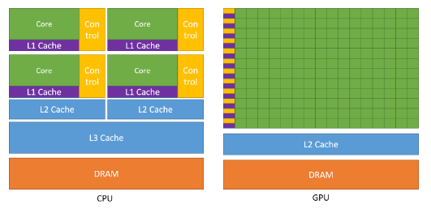
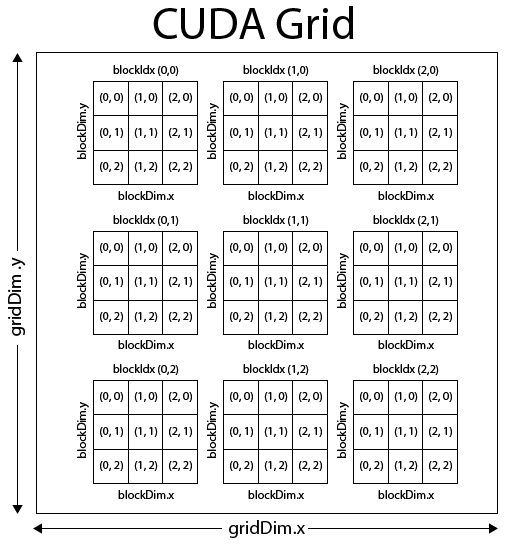
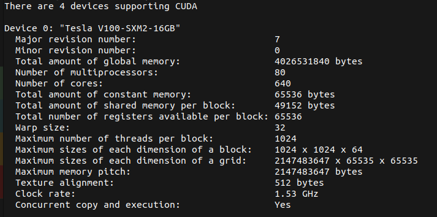
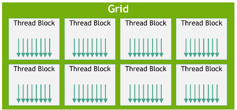
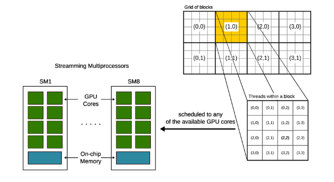
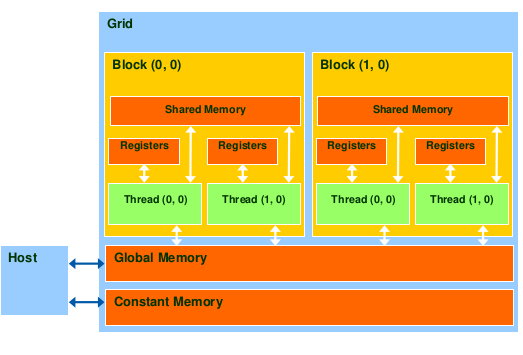

# CUDA

[TOC]

**Reference links**

* [CUDA C programming]: https://docs.nvidia.com/cuda/cuda-c-programming-guide/index.htm


## Introduction


### Why GPU ?

The GPU provides a different approach than the CPU:

* GPU have less powerful Cores than CPU but have a lot more.
* Typically limited by memory.



### CUDA programmer view

CUDA stands for Computer Unified Device Architecture, is the NVIDIA programming language for GPU hardware. 

* There's API calls for interact with the GPU.
* The programs executed in the GPU are called kernels. The kernels are executed into a grid of thread blocks (defined by the user).



CUDA and NVIDIA hardware are designed for a **Automatic Scalability**, because the NVIDIA hardware is built around an array o SMs (Streaming multiprocessors); <u>that means that with more SM's the computation will be faster automatically</u>.



Here, we can see that an example of the capabilities of a GPU (multiprocessors equals to SM), also we can see the the maximum sizes of the grids and blocks and some other hardware limits.

### Basic API

```c++
//Allocate memory in the GPU
cudaMalloc((void**) &A_d, vec_size*sizeof(float));

cudaMemcpy(A_d, A_h, vec_size * sizeof(float), cudaMemcpyHostToDevice);
cudaMemcpy(A_h, A_d, vec_size * sizeof(float), cudaMemcpyDeviceToHost);

cudaGetLastError(); //Check for an error running the kernel
cudaDeviceSynchronize(); // Wait for the kernel to end

cudaFree(A_d);
```

For invoke a kernel, use the triple `<<< >>>>` notation with the appropriate setup of the threads:

```c++
KernelName<<<numBlocks, threadsPerBlock>>>(paramA, paramB);
// Where numBlocks and threadsPerBlock are either int or dim3 structs
// Also can be named as GRID, BLOCK
```



Is important to check for possible run-time errors, all the API calls return a cudaError_t value.

```c++
void checkCudaError(const cudaError_t err){
    if(err == cudaSuccess) return;
    printf("%s : %s", cudaGetErrorName(err), cudaGetErrorString(err));
    exit(4);
}
```

## CUDA parallelism model

### Cuda compilation & method declaration

We can define several types of methods, depending where we want to execute them (host or device):

| Type                      | Executed on | Callable from |      Code      |
| ------------------------- | :---------: | :-----------: | :------------: |
| **device method**         |   device    |    device     | \__device\_\_  |
| **global method**         |   device    |     host      | \_\_global\_\_ |
| **host method (default)** |    host     |     host      |  \_\_host\_\_  |

The CUDA languague compiler (NVCC) generates the binary with the C/C++/Fortran code and a JIT file with the global and device methods (ptx file).

### Thread scheduling

This is the main view of a kernel execution.



Inside the **SMs** the **warps** are the basic scheduling units, this warps executes in a SIMD way. 

* Use whole warps leads to a better performance of the hardware.

* Since the warps are SIMD processors, all the threads executes the same instruction at any point leading to bad performance if not all the threads follow the same control path.

  A control divergence inside a warp leads to serialisation in the hardware, so ensure:

  * All loops iterate the same number of times.
  * All if-else-then statements make the same decision.

### Memory and data locality

We can define several variables types according to the memory used:

| Variable declaration                          |  Memory  |   Scope    | Lifetime |
| --------------------------------------------- | :------: | :--------: | :------: |
| int localVar;                                 | register |   thread   |  thread  |
| \__device\_\_ \_\_shared\_\_ int sharedVar;   |  shared  | block (SM) |  block   |
| \__device\_\_ int GlobalVar;                  |  global  |    grid    |   app    |
| \__device\_\_ \_\_constant\_\_ int sharedVar; | constant |    grid    |   app    |

Another way to see the different memories in the NVIDIA GPU is this:



## Tiled parallel algorithms

Some algorithms require a tiling/blocking solution for achieve performance. The main idea is to divide the global problem into tiles/blocks/chunks of data and each threads works locally. There are some points that are required for making this work on CUDA:

* The shared memory provides support this blocking/tiling.
* We must ensure that all threads in the tile finish their work after moving into the next chunk to be processed. Use `__syncthreads()` as a barrier construct.
* No all the algorithms can be tiled, the execution of each chunk must be equivalent, because we always wait for the slowest thread to continue our work (inbalance).

## Atomic operations && Histogramming


## Reductions


## Architecture considerations


## Efficient data transfers
